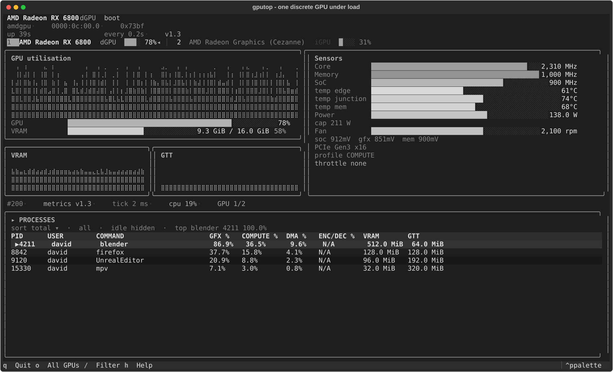
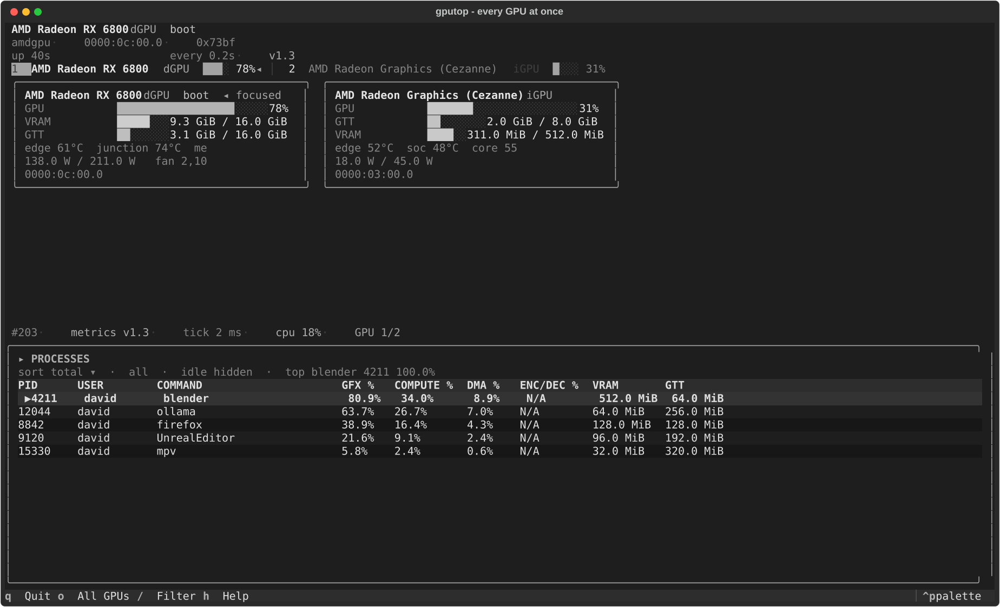
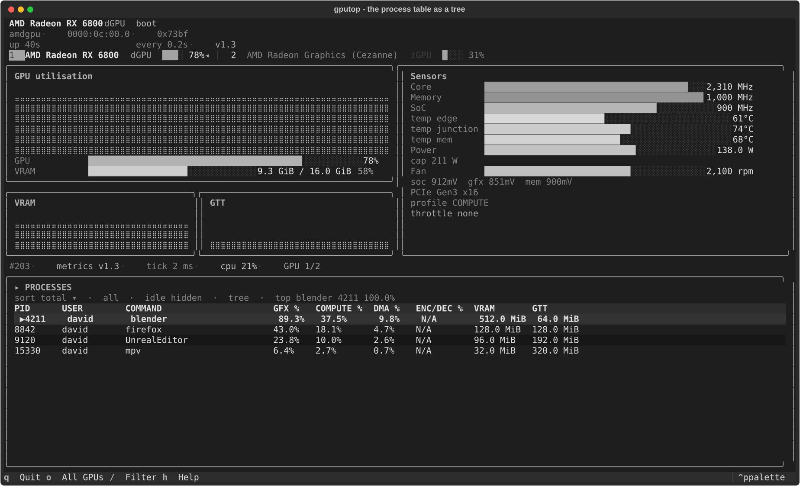
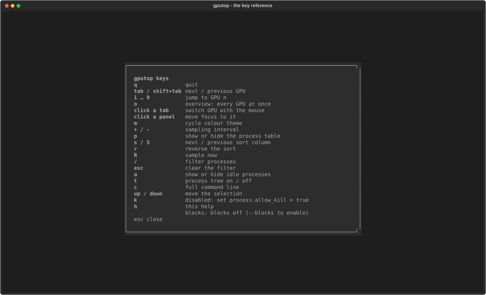
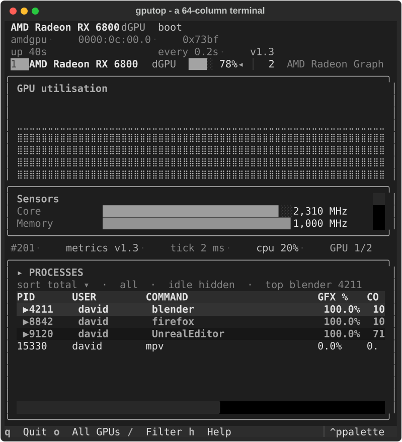

# gputop

A btop-style terminal monitor for AMD Radeon GPUs driven by the `amdgpu` kernel driver.
It reads what the kernel already publishes — utilisation, clocks, temperatures, power
against the enforced cap, throttle reasons, and every DRM client with its per-engine time
and resident memory — and it never writes to the GPU.



Everything on screen comes from files under `/sys/class/drm/card*/device/` and
`/proc/<pid>/fdinfo/`, all of them readable by an ordinary user. There is no daemon, no
setuid helper, and no write path at all: the power-profile and overdrive tables are
displayed, never set.

---

## Contents

- [Install](#install)
- [Supported hardware](#supported-hardware)
- [What each panel shows](#what-each-panel-shows)
- [`gputop --check`](#gputop---check)
- [Options](#options)
- [Keys](#keys)
- [Configuration](#configuration)
- [What it reads](#what-it-reads)
- [Cost: CPU and memory](#cost-cpu-and-memory)
- [Development](#development)

---

## Install

gputop needs **Python 3.14** — the standard build or the free-threaded one — and nothing
else. Python 3.14 is a hard floor, not a preference: the code is written against it, and
`3.13` or older cannot run it.

### pipx

```bash
pipx install gputop
```

### uv

```bash
uv tool install gputop
```

To pin the interpreter as well as the package:

```bash
uv tool install --python 3.14 gputop
```

### Arch Linux

A `PKGBUILD` ships with the source, in
[packaging/arch/PKGBUILD](packaging/arch/PKGBUILD):

```bash
cd packaging/arch
makepkg -si          # -s installs build dependencies, -i installs the result
```

It depends on `python>=3.14`, `python-textual` and `python-tomli-w`, installs the
`gputop(1)` man page and the bash, zsh and fish completions, and offers `radeontop` as an
optional dependency for the per-block panel.

### From a checkout

```bash
git clone https://github.com/gputop/gputop
cd radeon-btop
uv sync            # creates .venv with the pinned versions
uv run gputop
```

A man page is in [packaging/man/gputop.1](packaging/man/gputop.1) and completions for
bash, zsh and fish in [packaging/completions/](packaging/completions/). Neither ships in
the wheel; install them alongside the command if your shell expects them.

---

## Supported hardware

gputop talks to the kernel, not to a vendor library, so "supported" means "the driver
publishes the files the panel needs" rather than a list of marketing names.

| | |
|---|---|
| **Driver** | `amdgpu` (in-tree). A card bound to the older `radeon` driver is not visible to gputop; `gputop --check` says so. |
| **Kernel** | 5.19 or newer. 5.19 is the floor because it is the release that gave `/proc/<pid>/fdinfo` its DRM accounting keys — `drm-client-id`, `drm-engine-*`, `drm-memory-*` — which is the whole basis of the process table. amdgpu printed *something* there from 5.14, but under different key names, so a reader looking for the standard spelling finds nothing before 5.19. |
| **`gpu_metrics`** | 5.10 or newer. Before it, the interface still works from scattered sysfs attributes, one number at a time. |
| **Generations** | GCN 1–4 (Southern Islands through Vega), RDNA 1–4, and the APUs of each era. gputop reads generation-neutral paths; what appears depends on what the part publishes. |
| **Compute** | CDNA parts report through the same files; an APU's `gpu_metrics` table is the v2.x layout. |
| **Userspace** | None. gputop never opens a libdrm, Vulkan, ROCm or Mesa handle, so the Mesa version on your system cannot change a single number it prints. |

What differs by generation, and what `--check` will tell you on your own machine:

- **Fan and the extra temperatures.** Discrete cards expose `fan1_input`, `fan1_max` and
  `pwm1`; the second and third temperature channels (`temp2_*`, `temp3_*`) are an SOC15 dGPU
  feature. APUs are passively cooled and have no fan; gputop says "not on this GPU
  generation" rather than `N/A`.
- **`gpu_metrics` revision.** The file carries no version string: its identity is the
  four-byte header (`structure_size`, `format_revision`, `content_revision`), which is what
  gputop reads and shows. Which revision a card reports is not a dGPU/APU split — v1.3 is a
  Navi 21, v2.1 a Navi 23/24, only v2.2 and later are APU-shaped, and RDNA3 reports v3.0.
  An unrecognised revision is never guessed at: the interface falls back to sysfs and names
  the revision it is actually using.
- **Overdrive.** `pp_od_clk_voltage` means different things by generation: a list of
  per-level clock/voltage pairs on Vega10 and older, minimum/maximum ranges per clock
  domain on Vega20 and newer, and a `vddgfx` voltage offset only on the SMU13 parts that
  implement one. The panel labels what it found rather than assuming one of the three.
- **Power profiles.** `pp_power_profile_mode` (SCPP) exists only where the driver
  publishes it; on the parts that do, the panel shows the active profile and the whole
  table it was chosen from. Read-only either way.
- **HBM.** Instinct-class parts with HBM report a memory temperature that a GDDR6 card
  does not have. gputop shows whichever sensors exist and invents none.

**ROCm and other compute work.** Anything that takes a DRM descriptor shows up in the
process table: HIP and PyTorch on ROCm, Vulkan, OpenGL, VA-API video decode, `mpv`,
Blender. The driver reports a `compute` engine in the same accounting as any other, so
utilisation is attributed per engine (`gfx`, `compute`, `dma`, `enc`, `dec`) and memory is
what the client actually holds resident — an inference server running several models is
visible per model.

This is the right place to look rather than `/sys/class/kfd`: KFD publishes static device
topology (SIMD count, memory banks, queue enumeration) and no per-process utilisation at
all, so anything reading it would report the machine rather than the workload. The limit of
the approach is the same as the limit of any fdinfo reader: a queue that never opens a DRM
descriptor cannot be attributed.

---

## What each panel shows

Nine panels, laid out to survive a narrow or short terminal.

- **Devices** — every `amdgpu` card, discrete first. `tab` / `shift+tab` switch, `1`–`9`
  jump, `o` shows every GPU at once. The tab bar is clickable.
- **Utilisation** — busy %, with the memory panel leading on GTT for an integrated GPU.
- **Sensors** — clocks, temperatures, power against the enforced cap, fan, throttle
  reasons, PCIe link width and speed.
- **Processes** — a sortable, filterable table of DRM clients.

| Column | Meaning |
|---|---|
| PID | process id |
| USER | owning user |
| COMMAND | `/proc/<pid>/comm`, or the full command line with `c` |
| GFX / COMPUTE / DMA / ENC-DEC % | utilisation per engine over the last interval |
| VRAM / GTT | resident memory attributed to the client |

Rows holding a descriptor but using nothing measurable are hidden; press `a` to see them.
The client using the most GPU is marked `▶` and named in the panel heading, so the answer
to "what is my GPU doing" is on screen without reading a number.

Two panels are optional and off by default:

- **Blocks** — per-block utilisation (Graphics pipe, Texture Cache, Shader Export, …)
  and memory/shader clock bars. The driver exposes these counters only through a
  privileged radeon ioctl, so gputop runs `radeontop -d -` as a child process and parses
  its dump. gputop itself never needs root; only the child inherits whatever privilege
  radeontop requires. Enable with `--blocks` or `blocks.enabled = true`. When it cannot
  run, the panel is hidden and the status line names which of the four reasons applies.
- **Power profile** — the active SCPP profile and every alternative the driver offers,
  then each `pp_od_clk_voltage` domain's overdrive ceiling as a bar. Read from sysfs and
  shown whether or not radeontop can.

| Overview: every GPU at once | The process table as a tree |
|:---:|:---:|
|  |  |

---

## `gputop --check`

A panel showing `N/A` is easy to read and hard to act on: the same `N/A` means "this GPU
has no fan", "your kernel predates the attribute", "you need to be another user", or "a
newer gputop knows how to read it". `--check` tells them apart.

```console
$ gputop --check
gputop check
================================================================================

kernel           7.0.0-34-generic
amdgpu           6.19.4
python           3.14.6
build            free-threaded
sysfs            /sys/class/drm
procfs           /proc
render nodes     none found (no /dev/dri entry for these cards)

card1  AMD Radeon RX 6800  (0000:0c:00.0, discrete, 0x73bf)
metrics ABI       v1.3

METRIC              STATUS      SOURCE                      VALUE
------------------  ----------  --------------------------  -----
GPU utilisation     ok          gpu_metrics+sysfs           95.0 %
Memory utilisation  ok          gpu_metrics+sysfs           67.0 %
VRAM                ok          mem_info_vis_vram_*         15624 MiB / 16368 MiB
GTT                 ok          mem_info_gtt_*              721 MiB / 15994 MiB
Graphics clock      ok          gpu_metrics                 2105 MHz (max 2475)
Temperatures        ok          hwmon+gpu_metrics           edge 74 C, junction 80 C, mem 76 C
Power draw          ok          hwmon+gpu_metrics           152 W (cap 211 W)
Fan                 ok          hwmon+gpu_metrics           797 RPM, 29 % duty
Throttle status     ok          gpu_metrics                 idle
PCIe link           ok          gpu_metrics+current_link_*  Gen5 x16
Power profile       ok          pp_power_profile_mode       BOOTUP_DEFAULT
Overdrive table     ok          pp_od_clk_voltage           2 clock domains

System-wide
--------------------------------------------------------------------------------
METRIC           STATUS      SOURCE                      VALUE
---------------  ----------  --------------------------  -----
Process table    ok          /proc/<pid>/fdinfo          0 GPU clients of 5 processes
Per-block panel  disabled    radeontop                   -
                             -> turned off

16/17 metrics available
```

Every absence names a cause and, where there is one, a remedy: a permission problem, a
kernel version, a GPU generation, a missing `radeontop`, a `gpu_metrics` revision this
build does not know. `--check --json` emits the same report as JSON for scripts and bug
reports. It never starts `radeontop`, and it exits 3 when there is no AMD GPU at all — the
same status `--dump` and `--devices` use, so a script can tell "no hardware" from
"gputop is broken".

On a card whose driver publishes almost nothing — an APU on an old kernel, say — the
report is mostly reasons, which is the point:

```console
$ gputop --check
gputop check
================================================================================

kernel           7.0.0-34-generic
amdgpu           6.19.4
python           3.14.6
build            free-threaded
sysfs            /sys/class/drm
procfs           /proc
render nodes     none found (no /dev/dri entry for these cards)

card0  AMD Radeon Graphics (Cezanne)  (0000:0c:00.0, integrated, 0x1638)
metrics ABI       none (sysfs only)

METRIC              STATUS      SOURCE                      VALUE
------------------  ----------  --------------------------  -----
GPU utilisation     missing     gpu_metrics+sysfs           -
                                -> not published: the driver does not create gpu_metrics on this card
VRAM                ok          mem_info_vis_vram_*         - / 512 MiB
Temperatures        missing     hwmon+gpu_metrics           -
                                -> not published: hwmon exists but holds no value this build can use
Fan                 missing     hwmon+gpu_metrics           -
                                -> not on this GPU generation: an integrated GPU has no fan to report
Power profile       missing     pp_power_profile_mode       -
                                -> not published: the driver does not create pp_power_profile_mode on this card
…
2/18 metrics available  (16 not available, each explained above)
```

---

## Options

| Option | Meaning |
|---|---|
| *(none)* | Start the interface |
| `--version` | Print the version and exit |
| `-c`, `--config PATH` | Read configuration from `PATH` instead of searching the defaults. Naming a file also means naming the whole configuration: the saved `[state]` is not layered on top, so a scripted run cannot inherit the last interactive session. |
| `-i`, `--interval SECONDS` | Sampling interval, overriding `general.interval_ms`. Floored at 0.05 s. |
| `--drm-root PATH` | sysfs DRM class directory (default `/sys/class/drm`) |
| `--proc-root PATH` | procfs mount point (default `/proc`) |
| `--dump` | Write one JSON snapshot of the live machine to stdout and exit |
| `--devices` | List discovered GPUs as JSON and exit |
| `--check` | Report which metrics this machine can provide, and why any are missing |
| `--json` | Emit `--check` as JSON instead of text |
| `--kind {auto,igpu,dgpu}` | Force every device to be classified as integrated or discrete |
| `--theme {default,dracula,gruvbox}` | Colour theme, also switchable with `m` |
| `--no-color` | Disable 24-bit colour and fall back to the terminal's ANSI palette |
| `--no-processes` | Skip the `/proc` scan, the most expensive part of a sample |
| `--pretty` | Indent `--dump` and `--devices` output |
| `--blocks` / `--no-blocks` | Force the per-block panel on or off for this run |
| `--log PATH` | Record the session: `.csv` or `.json`, optionally `.zst`-compressed |

Exit status is 0 on success and 3 when no `amdgpu` device was found (`--dump`,
`--devices`, `--check`).

---

## Keys

| Key | Action |
|---|---|
| `q` | quit |
| `tab` / `shift+tab` | next / previous GPU |
| `1`–`9` | jump to GPU *n* |
| `o` | overview: every GPU at once |
| `h`, `?` | key reference |
| `/` | filter the process table by name, command, user or pid |
| `escape` | clear the filter |
| `R` | sample now |
| `+` / `-` | sampling interval |
| `m` | cycle colour theme |
| `p` | show or hide the process table |

In the process table:

| Key | Action |
|---|---|
| `s` / `S` | next / previous sort column |
| `r` | reverse the sort |
| `a` | show or hide idle clients |
| `t` | process tree |
| `c` | full command line |
| `up` / `down`, click | move the selection |
| `k` | send a signal to the selection (only when `process.allow_kill = true`) |

The selection follows the *process*, not the row index, so it stays on the same client as
the table reorders.

`h` shows the same reference in a scrollable overlay, and the layout survives a terminal
that is not 150 columns wide:





---

## Configuration

TOML, read from the first of `$GPUTOP_CONFIG`, `~/.config/gputop/gputop.toml`,
`~/.gputoprc` that exists. Unknown keys are a warning, not an error, so a file written for
a newer release still works. A fully commented file is in
[gputop.example.toml](gputop.example.toml).

### `[general]`

| Key | Default | Meaning |
|---|---|---|
| `interval_ms` | `1000` | Sampling interval, 100–10000. The `/proc` scan dominates a sample, so going much below 100 ms mostly buys duplicate work. |
| `history_points` | `300` | Samples retained for the graphs. Five minutes at 1 s. |

### `[gpu]`

| Key | Default | Meaning |
|---|---|---|
| `kind` | `"auto"` | `"auto"`, `"igpu"` or `"dgpu"`. Forcing it overrides the heuristics, for an APU they misjudge. |
| `devices` | `()` | Restrict to these cards. A card is named by its PCI address (`0000:0c:00.0`), the same address without the domain (`0c:00.0`), or its `cardN` sysfs node. An entry matching no card is reported in the status line and ignored; a filter matching *none* of them watches every card rather than none, so a typo cannot blank the monitor. |
| `[gpu.names]` | `{}` | Marketing names for cards not in the built-in table, keyed by PCI address. |

### `[process]`

| Key | Default | Meaning |
|---|---|---|
| `show` | `true` | Show the per-client table. |
| `max_rows` | `20` | Rows to display; the busiest clients are kept. |
| `sort` | `"total"` | `total`, `pid`, `user`, `command`, `gfx`, `compute`, `dma`, `endcdc`, `vram`, `gtt`. |
| `min_usage_percent` | `0.0` | Hide clients below this. 0 keeps anything doing *something*. |
| `hide_kernel_threads` | `true` | Hide clients with no argument vector. |
| `process_tree` | `false` | Nest the table by parent process. |
| `full_command` | `false` | Show `/proc/<pid>/cmdline` instead of `comm`. |
| `show_idle` | `false` | Show clients holding a descriptor but using nothing. |
| `allow_kill` | `false` | Allow `k` to signal the selection. Off by default: terminating another process from a monitor is one keystroke from terminating the wrong one. When on, the signal is still chosen from a dialog that names the target. |

### `[ui]`

| Key | Default | Meaning |
|---|---|---|
| `theme` | `"default"` | `default`, `dracula` or `gruvbox`. |
| `no_color` | `false` | ANSI colours instead of 24-bit. |
| `graph_height` | `0` | Rows in the utilisation graph. `0` — the default — lets it fill whatever the layout can spare, which is what a fluid layout wants. A positive value pins it to that many rows, for anyone who wants a tall graph and is tired of it shrinking on every resize; it is clamped down rather than allowed to overflow the terminal. |

How many *points* each graph holds is `general.history_points`, and there is deliberately
no second key for it under `[ui]`: the graphs are fed from the sampler's history buffer, so
a graph cannot retain more samples than the sampler keeps for it, and a second number could
only ever be one of the two silently capping the other.

### `[blocks]`

| Key | Default | Meaning |
|---|---|---|
| `enabled` | `false` | Show the per-block panel. Off by default: it starts `radeontop`, which on most unprivileged systems answers "are you root?". `--blocks` / `--no-blocks` override it for one run. |
| `binary` | `"radeontop"` | Program name on `$PATH`, or an absolute path. |
| `ticks` | `120` | Samples per second asked of radeontop. |
| `interval_s` | `1` | Seconds between dumps. Whole seconds only: radeontop parses `-i` with `atoi`. |
| `drm_root` | `"/dev/dri"` | Where DRM nodes live, so `-p` can be used instead of an ambiguous bus number. |
| `restart` | `true` | Restart a child that dies mid-session. Bounded, and never retried when the refusal is permanent. |

### `[alerts]`

| Key | Default | Meaning |
|---|---|---|
| `enabled` | `true` | Flash panel borders when a reading crosses a threshold. |
| `temp_c` | `90.0` | Hottest sensor, clamped to 125. `0` disables this check. |
| `power_percent` | `95.0` | Draw against the enforced cap, 0–100. `0` disables. |
| `vram_percent` | `92.0` | VRAM in use, 0–100. `0` disables. |
| `flash_hz` | `1.0` | Full flash cycles per second, 0–20. `0` holds a steady border. |

Thresholds are recomputed from scratch every sample, so a condition that clears stops
being reported the moment it clears. The *hottest* sensor is judged rather than the
average, and every GPU is checked rather than only the focused one.

### `[log]`

| Key | Default | Meaning |
|---|---|---|
| `zstd_level` | `3` | Compression level for a `.zst` target, 0–19. |
| `interval_s` | `0.0` | Seconds between records; `0` records every sample. |

Recording is only turned on by `--log`; the filename picks the format (`.csv` or `.json`)
and, with a trailing `.zst` or `.zstd`, the compression. Files are appended and flushed
per record, so an interrupted session still leaves a readable file.

### `[state]`

Written by gputop, not by you: the theme, interval, sort, filter and view choices from
the last session, in `~/.config/gputop/config.toml` (`$GPUTOP_STATE` overrides the path).
It wins over the values above, which is the point of it. Delete the section to go back to
what the file says by hand.

---

## What it reads

All of it unprivileged, all of it read-only:

- `/sys/class/drm/card*/device/` — VRAM/GTT, busy %, DPM clocks, power profile, overdrive
- `/sys/class/drm/card*/device/gpu_metrics` — versioned binary metric table (v1.x/v2.x)
- `/sys/class/drm/card*/device/pp_power_profile_mode` — the SCPP profile table
- `/sys/class/drm/card*/device/pp_od_clk_voltage` — per-domain overdrive ceilings, vddgfx
- `/sys/class/hwmon/hwmon*/` — temperatures, power, fan
- `/proc/<pid>/fdinfo/` — per-process VRAM/GTT and per-engine utilisation

The one thing gputop does not read from a file is the optional blocks panel: with
`blocks.enabled` it starts `radeontop` as a child process and parses its dump output.
That is a child process gputop starts, not a file it opens, and it is the only part of the
program that can need privileges.

The application never writes to sysfs.

---

## Cost: CPU and memory

Measured with `tools/profile_gputop.py` on the development machine (24-core x86-64,
Navi 21 / RX 6800, kernel 7.0), at the default 1 s interval:

| | |
|---|---|
| Sampler tick, one device | **1.8 ms** (≈27 small sysfs reads) |
| `/proc` scan | **0.2 ms** for 5 processes, **~12 µs per process** — about 12 ms on a 1000-process desktop, 48 ms at 4000 |
| Whole sample | **2.7 ms** |
| Running interface, 120×40 | **≈4 % of one core**, of which roughly a quarter is gputop's own code and the rest is Textual's layout and paint |
| Peak RSS | **≈78 MiB** with the interface running, ≈35 MiB for the sampler alone |

The `/proc` scan is the only part whose cost grows with the size of the *system* rather
than the number of GPUs, so it is the one that was optimised: it is written against the
`os` string APIs rather than `pathlib`, because a `Path` per descriptor cost more than the
syscall it wrapped. That took a 1000-process scan from 25 ms to 11.5 ms. The braille
rasteriser accumulates per dot column rather than per sample, which halved its cost, and
the interface stopped re-asserting inline styles that were already set — a per-sample
repaint of every panel, to arrive at the layout that was already there.

To measure your own machine:

```bash
uv run python tools/profile_gputop.py tick          # the sampler alone
uv run python tools/profile_gputop.py procfs --scaling   # /proc scan vs system size
uv run python tools/profile_gputop.py render        # the whole interface
uv run python tools/profile_gputop.py memory        # RSS over time
```

Add `--profile` to any of them to get a cProfile breakdown, and `--synthetic 1000:50` to
point the scan at a synthetic `/proc` of that size.

---

## Development

```bash
uv sync                 # pinned environment (.python-version and uv.lock)
uv run pytest           # the suite
uv run ruff check . && uv run ruff format --check .
uv run mypy             # strict, over src/
```

CI runs ruff, mypy and pytest on Python 3.14, plus a non-blocking job on the
free-threaded build (3.14t) — gputop's sampler/UI split exists precisely so the GIL can
go, but Textual and Rich have no free-threaded CI of their own, so that job is evidence
this project collects rather than a guarantee anyone else provides.

Pinned for a reason, documented in [pyproject.toml](pyproject.toml): Textual ≥ 8.2.8
(3.14 support landed in 6.3.0) and Rich ≥ 15 (3.14 fix in 14.2.0), both `<` their next
major. mypy ≥ 2.3.1 is the first release with compiled `cp314t` wheels, which is what
makes the free-threaded type check worth running.

Other tools:

```bash
uv run python tools/make_screenshots.py   # regenerate docs/screenshots/*.svg
uv run python tools/profile_gputop.py     # the measurements above
```

The screenshots in this README are Textual SVG exports of the running interface over a
deterministic synthetic two-GPU machine, so re-running the tool reproduces them and they
cannot drift from what the program draws.

See [PROGRESS.md](PROGRESS.md) for the verification ledger: what was measured on real
hardware, what was verified against fixtures, and what is still assumed.

---

## Licence

GPL-3.0-or-later.